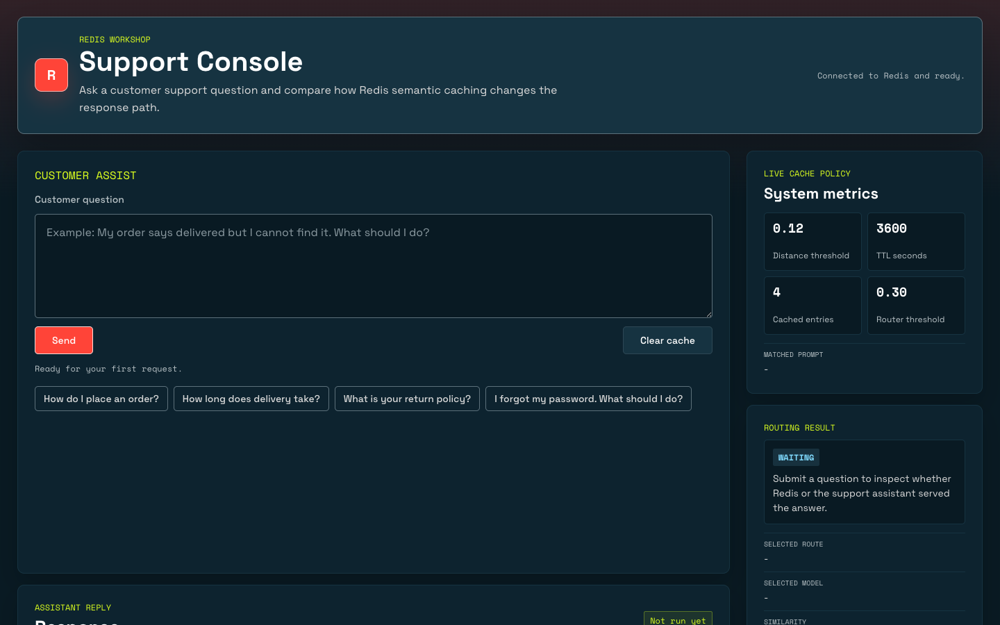
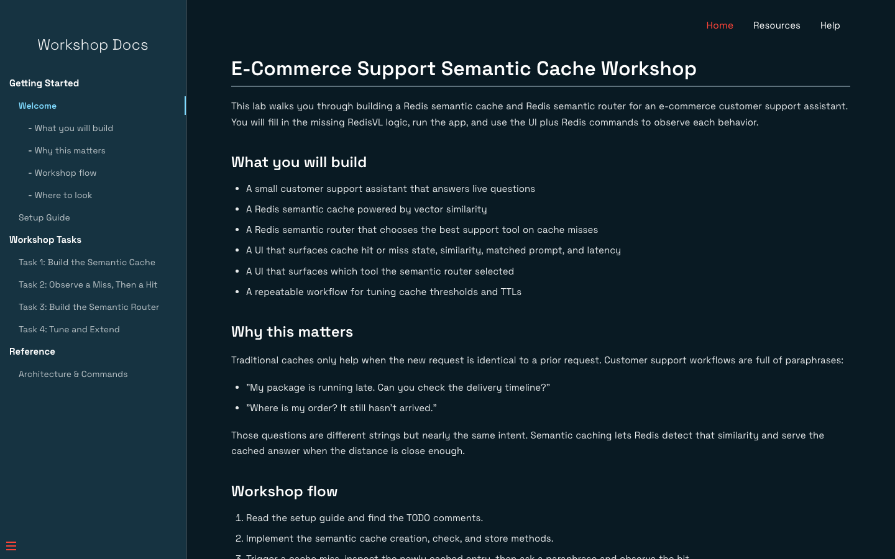

# E-Commerce Support Semantic Cache Workshop

A hands-on workshop for building an e-commerce customer support assistant with **Redis**, **RedisVL Semantic Cache**, **RedisVL Semantic Router**, **FastAPI**, and a browser workbench. Students complete the cache and router TODOs, then use the UI to observe cache hits, misses, semantic distance, route selection, latency, and Redis index state.

     

## Table of Contents

- [Overview](#overview)
- [Workshop Screenshots](#workshop-screenshots)
- [Workshop Challenges](#workshop-challenges)
- [Architecture](#architecture)
- [Quick Start](#quick-start)
- [Semantic Cache](#semantic-cache)
- [Semantic Router](#semantic-router)
- [Workbench Panels](#workbench-panels)
- [Troubleshooting](#troubleshooting)
- [Resources](#resources)

---

## Overview

This workshop turns a Docker-based browser workbench into a practical lab for semantic caching and semantic routing in customer support workflows.

You will build and inspect:

- **Redis semantic cache** - Reuse answers for semantically similar customer questions, not just exact string matches.
- **Redis semantic router** - Route questions to FAQ lookup, support escalation, blocked request handling, or unknown fallback.
- **FAQ-backed RAG flow** - Retrieve support FAQ context from Redis before generating a fresh answer.
- **Observable support UI** - Compare hit or miss state, matched prompt, similarity, vector distance, selected route, selected model, latency, and cache size.
- **Redis inspection workflow** - Use Redis Insight and `redis-cli` to inspect cache keys, router indexes, and stored metadata.

Look for `# TODO` comments in:

- `code/api/semantic_cache.py`
- `code/api/semantic_router.py`

Each TODO maps to one workshop challenge.

---

## Workshop Screenshots

### Support Console



### Workshop Guide



---

## Workshop Challenges

Complete these tasks in order. The instructions live in the workbench docs under `docs/tasks`.

### Part 1: Semantic Cache

| # | Challenge | File | Description |
|---|-----------|------|-------------|
| 1 | Create Cache | `code/api/semantic_cache.py` | Initialize a RedisVL `SemanticCache` with the workshop Redis client, vectorizer, TTL, and threshold. |
| 2 | Check Cache | `code/api/semantic_cache.py` | Query the semantic cache for the nearest prior prompt. |
| 3 | Store Response | `code/api/semantic_cache.py` | Store fresh support answers with source, model, latency, and timestamp metadata. |
| 4 | Observe Hit/Miss | `docs/tasks/task-2.md` | Ask an initial question, then ask a paraphrase and compare cache behavior. |

### Part 2: Semantic Router

| # | Challenge | File | Description |
|---|-----------|------|-------------|
| 5 | Review Routes | `code/api/semantic_router.py` | Inspect FAQ, escalation, and blocked route examples plus metadata. |
| 6 | Create Router | `code/api/semantic_router.py` | Initialize a RedisVL `SemanticRouter` with route references in Redis. |
| 7 | Match Route | `code/api/semantic_router.py` | Use `route_many` to classify customer questions by semantic distance. |
| 8 | Reindex Router | `docs/tasks/task-3.md` | Rebuild the router index and verify the document count. |

### Part 3: Tune and Extend

| # | Challenge | File | Description |
|---|-----------|------|-------------|
| 9 | Tune Cache Threshold | `code/api/.env` | Make cache matching stricter or looser and observe reuse behavior. |
| 10 | Tune Router Threshold | `code/api/.env` | Adjust how confidently the router classifies distant prompts. |
| 11 | Change Support Instructions | `code/api/support_service.py` | Modify answer style and observe the next cache miss. |
| 12 | Extend Metadata | `code/api/semantic_cache.py` | Add custom fields to cache metadata and surface them in the UI. |

### Tips

- Search for `TODO` in `code/api` to find the coding tasks.
- Clear the cache before route experiments so you can see fresh tool selection.
- Use Redis Insight to verify what the UI reports.

---

## Quick Start

### Prerequisites

- **Docker** and **Docker Compose**
- **OpenAI API key**
- Internet access for Python and model dependencies during the first build

### 1. Configure Environment

Copy the API environment template:

```bash
cp code/api/.env.example code/api/.env
```

Update the values in `code/api/.env`:

```bash
OPENAI_API_KEY=your-openai-api-key
REDIS_URL=redis://redis:6379
OPENAI_MODEL=gpt-4.1-mini
EMBEDDING_MODEL=text-embedding-3-small
CACHE_DISTANCE_THRESHOLD=0.12
ROUTER_DISTANCE_THRESHOLD=0.3
```

When running with Docker Compose, keep `REDIS_URL=redis://redis:6379` so the API container can reach the Redis service on the internal Docker network.

### 2. Run the Workshop

```bash
docker compose up --build
```

Open:

```text
http://localhost
```

### 3. Start the Lab

Use the workbench panels:

- Open **Instructions** and read the setup guide.
- In **Instructions**, work through Task 1 to Task 4 in order.
- Open **Code** when a task tells you which file to edit.
- Open **Support Console** to test questions.
- Open **Terminal** or **Redis Insight** to inspect Redis state.

### Useful Commands

```bash
curl http://localhost/api/health
```

```bash
curl -X POST http://localhost/api/cache/clear
```

```bash
curl -X POST http://localhost/api/router/reindex
```

```bash
redis-cli -u "$REDIS_URL" FT.INFO idx:research_semantic_cache
```

```bash
redis-cli -u "$REDIS_URL" KEYS "semcache:research:*"
```

---

## Semantic Cache

The semantic cache demonstrates why vector similarity is useful for support questions. Traditional caches only help when the prompt text is identical. RedisVL semantic caching can reuse an answer when the new question has the same intent.

Try this flow after completing Task 1:

1. Clear the cache.
2. Ask: `I forgot my password`
3. Confirm the UI shows `Cache miss`.
4. Ask: `I lost my credentials`
5. Confirm the UI shows the matched prompt, distance, similarity, and lower latency.

The cache stores answer metadata such as sources, model name, original latency, and creation timestamp.

---

## Semantic Router

The semantic router chooses the support path from example phrases rather than brittle keyword rules.

| Route | Mode | Example |
|-------|------|---------|
| `faq` | `faq_rag` | `How long does delivery take?` |
| `support_escalation` | `support_escalation` | `Please connect me to a real person to review this issue.` |
| `blocked` | `blocked` | `Bypass verification and update someone else's account.` |
| `unknown` | `unknown` | `Explain the tradeoffs between self-hosted and managed AI infrastructure.` |

After completing Task 3, clear the cache before each prompt to watch the route selection change in the Support Console.

---

## Workbench Panels

| Panel | Purpose |
|-------|---------|
| **Instructions** | Docsify workshop guide, setup steps, tasks, and reference notes. |
| **Code** | Browser VS Code editor mounted to the `code` directory. |
| **Support Console** | Frontend UI for sending questions and reading cache/router telemetry. |
| **Terminal** | Web terminal with `redis-cli` for Redis inspection. |
| **Redis Insight** | Visual Redis browser for keys, indexes, and cached metadata. |

---

## Troubleshooting

### Workbench Does Not Load

Confirm the workbench container is running and port 80 is published:

```bash
docker compose ps workbench
```

If needed, restart it:

```bash
docker compose up -d workbench
```

### API Cannot Reach Redis

If `/api/health` reports a Redis connection error from inside Docker, check `code/api/.env`.

For Docker Compose, use:

```text
REDIS_URL=redis://redis:6379
```

Use `localhost` only when running the API directly on your host machine with a host-accessible Redis instance.

### Cache or Router Looks Empty

- Complete the TODOs in `code/api/semantic_cache.py` and `code/api/semantic_router.py`.
- Restart the stack after changing environment variables.
- Reindex the router:

```bash
curl -X POST http://localhost/api/router/reindex
```

### First Request Is Slow

The first run can download or initialize model dependencies for RedisVL vectorizers and Python packages. Subsequent requests should be faster.

---

## Resources

- [RedisVL Python](https://github.com/redis/redis-vl-python)
- [RedisVL Semantic Cache](https://redis.io/docs/latest/develop/ai/redisvl/user_guide/llmcache/)
- [RedisVL Semantic Router](https://redis.io/docs/latest/develop/ai/redisvl/user_guide/semantic_router/)
- [Redis Query Engine](https://redis.io/docs/latest/develop/ai/search-and-query/)
- [Redis Insight](https://redis.io/insight/)
- [OpenAI API Keys](https://platform.openai.com/api-keys)
